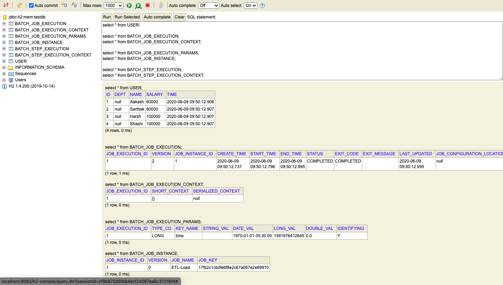

# Spring-Batch-In-Spring-Boot-Example
In this repository, I have covered the Spring Boot with Spring Batch example for loading CSV into Database.
##First Step
1. Create a Spring Boot Project <a href="https://start.spring.io/">here</a> 
2. Give Group & Artifact Id 
3. Add Dependencies: 
<ul>
  <li>Spring Batch</li>
  <li>Spring Web</li>
  <li>H2 Database</li>
  <li>Spring Data JPA</li>
  <li>Spring Boot DevTools</li>
</ul>

## This is what we'll see as an output after hitting http://localhost:8082/load

